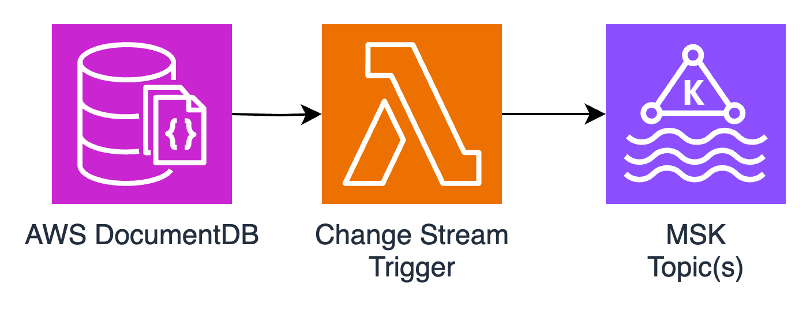

# What Is This
This is an example lambda function that handles events from the DocumentDB Lambda Trigger and sinks them into Kafka Topics



## Enable Change Stream(s) in DocumentDB

```python
mongoClient["admin"].command({"modifyChangeStreams": 1,
    "database": "test_db",
    "collection": "",
    "enable": True});
```

## Configure Lambda Trigger

```terraform
resource "aws_lambda_event_source_mapping" "docdb_event_lambda_source" {
  function_name = aws_lambda_function.docdb_event_lambda.function_name
  event_source_arn = document_db_cluster.my_cluster.cluster_id
  batch_size = 1000
  maximum_batching_window_in_seconds = 1
  starting_position = "TRIM_HORIZON"
  
  source_access_configuration {
    type = "BASIC_AUTH"
    uri = aws_secretsmanager_secret.docdb_worker_secret.arn
  }

  document_db_event_source_config {
    database_name = "test_db"
    full_document = "UpdateLookup"
  }
}
```

### Ensuring Reachability
AWS will configure the lambda trigger watchers inside the DocumentDB Subnet.

This subnet and security group will either need PrivateLink or NAT Gateway access to:
- STS
- Lamdda
- SecretsManager

Assuming all VPCs/Security Groups/Endpoints are configured correctly the rest is easy :)
